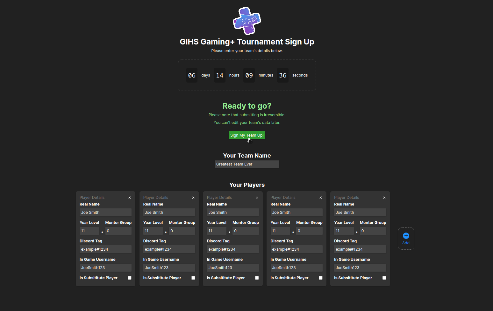

# GIHS Gaming+ Tournament Sign-Up
A nice website to sign people up for the Gaming Club tournaments. Does field validation on all the team members, then sends it to an API which stores the team in JSON.



# API Docs
This is just how the frontend sends stuff to the backend, it doesn't matter much but here it is.
```
POST /api/register

Payload:
{
    "name": "Greatest Team Ever",
    "members": [
        {
            "name": "Joe Smith",
            "year": 11,
            "mg": 0,
            "discord": "example#1234",
            "ign": "JoeSmith123",
            "sub": false,
            "valid": true
        },
        { ... },
        { ... },
        { ... },
        { ... }
    ]
}
```